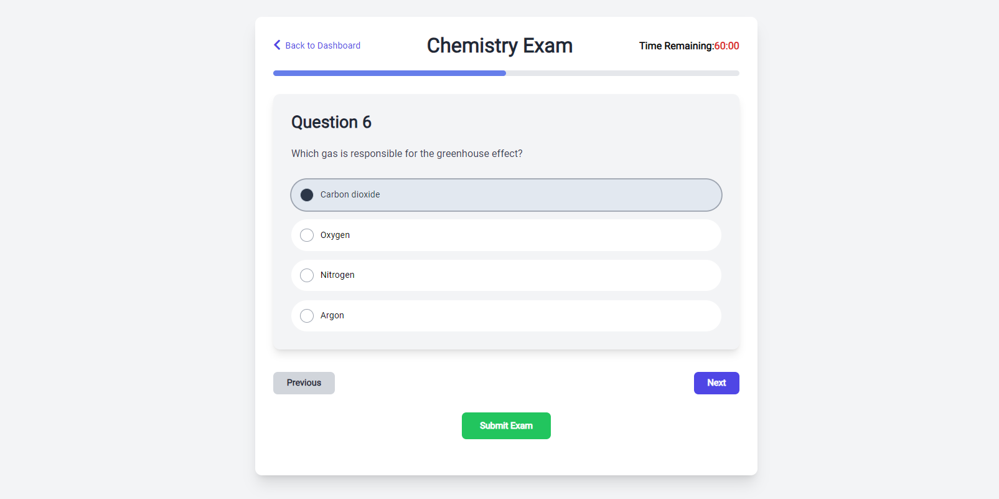

# Online Exam Platform

## Description
The Online Exam Platform is a web application that facilitates online examinations. It supports user registration, login, exam participation, result viewing, and includes an admin panel for exam management.




## Features
- **User Authentication**: Secure registration and login using JWT authentication with bcrypt for password hashing.
- **Exam Participation**: Users can take exams within a set time limit.
- **Result Viewing**: Users can view their exam results and receive detailed feedback.
- **Admin Panel**: Admins can manage exams, including adding, removing, or updating exam details and questions.

## Technologies Used
### Frontend
- **Vue.js 3** with TypeScript
- **Tailwind CSS**: A utility-first CSS framework for custom designs.
- **Pinia**: State management for Vue.js applications.
- **Axios**: HTTP client for API requests.

### Backend
- **ASP.NET Core**: Framework for modern, cloud-based applications.
- **MongoDB**: NoSQL database for user data, exam details, and results.
- **JWT Authentication**: Secure user authentication.
- **Bcrypt**: Password hashing library.

## Getting Started
### Prerequisites
- Node.js and npm
- Visual Studio or Visual Studio Code
- MongoDB (local or remote)

### Installation
Clone the repository:
```bash
git clone https://github.com/efeturkemir/online-exam-platform.git
```

Install dependecies:
```bash
cd frontend
npm install
cd ../examApi
dotnet restore
dotnet run
```
## Configuration
- Configure MongoDB connection string in appsettings.json.
- Set JWT secret key and your database URL in appsettings.json.

## Admin Panel
- Access the admin panel with admin credentials.
- Admin credentials can be set in the database or through a registration process with special privileges.

## Contributing
Contributions are welcome! Submit pull requests or open issues for feature requests, bug fixes, or improvements.

